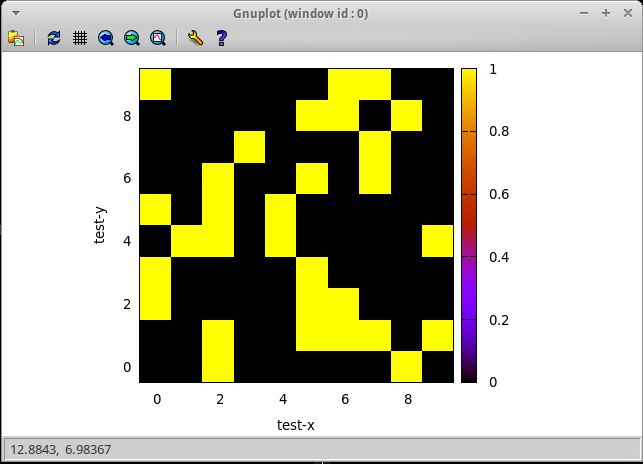
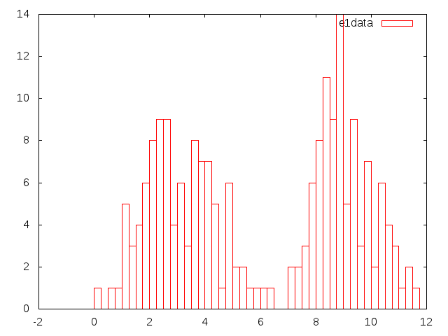

An Interactive Interface to GNUPlot for J
-----------------------------------------

J is great!  However, its plotting capabilities are somewhat limited compared to other great data analysis platforms like Matlab.  This is particularly true when one is working from `jconsole`, where gtk plots are disabled.

This library uses unix named pipes to interactively mediate between a gnuplot session and your J interpreter.  This lets you do sweet stuff like:

    load 'igp.ijs'

    title 'testing image'
    xlabel 'test-x'
    ylabel 'test-y'
    
    image (5 < (? (10 10 $ 10)))

And produce something like this:

There are handful of utility words, but the basic idea is that you call the monad `ensureGnuPlot''` to get a handle to the gnuplot session, and then you use the utility functions to interact with it.

The mother of all utility functions is the adverb `gpfmt` which lets you pass formatted strings to gnuplot:

    'set xlabel "%s"' (ensureGnuPlot'') gpfmt 'some label text'

You can make this easier to use in your session by saying:

    gp =: (ensureGnuPlot'') gpfmt

And then use it like so:

    'set xlabel "%s"' gp "test"

The verbs 

    title, xlabel, ylabel, xrange, yrange, image, histogram,
    saveplot, reset

Are predefined to interact with gnuplot (these are my initial use cases).  In the monadic case they use the result of `ensureGnuPlot''` while their dyadic cases take `x` as they gnuplot handle.

Most of these verbs are self evident in their usage, but documentation for some is useful:

1. `histogram` plots a histogram of the list of data stored in `y` to either the default gnuplot session in the monadic invocation or to the gnuplot pointed to by `x`.  `x` may additionally be a rank 2 box array whose first column is option names and whose second column is value.  In this case, the supported options are, `gnuplot`, the gnuplot session; `binwidth`, the width of bins to use, and `plot-title`, the name of the plot lines, rather than the title of the entire plot.
2.  `options` takes a rank 1, even lengthed, box list and converts it into an options object appropriate for `histogram` and other functions which require options.

Example:

    clusterSize1 =: 100
    e1d1 =: (3 1.2) gausian clusterSize1
    e1d2 =: (9 1.2) gausian clusterSize1

    e1labeled =:  (((clusterSize1$0),(clusterSize1$1))) ,: (e1d1,e1d2)
    e1data =: 1 { e1labeled
    e1labels =: 0 { e1labeled

    reset''
    (opts ('plot-title';'e1data';'binwidth';0.25)) histogram e1data

Makes something like:

Interacting with Data
---------------------

Gnuplot prefers to read its data from the file system.  To facilitate this interaction mode, `gpi` provides an adverb called `withFilenames` which takes a list of objects and calls `u` with a list of temporary filenames so that they can be passed into gnuplot.  These files are filled with the system word `fwrites` from the data objects passed in on the right side of `withFilenames`.  There are monadic and dyadic cases of the expanded verb, with the latter simply passing through `x`.

Example:

    imagebody_raw =: dyad define 
      data =. ,>y
      'plot "%s" matrix with image' x gpfmt <data
    )

    image_raw =: verb define 
      (ensureGnuPlot'') image y 
    :
      x (imagebody withFilenames) <y
    )

Here, `image_raw` calls `imagebody_raw` with a temporary file name containing the data in `y`.

Data is dumped into the `tmp` directory, but you may want to delete it periodically if you are dealing with large data sets.

There is also the helper verb `asFile` which takes a single data object and returns a file into which that data has been dumped.

